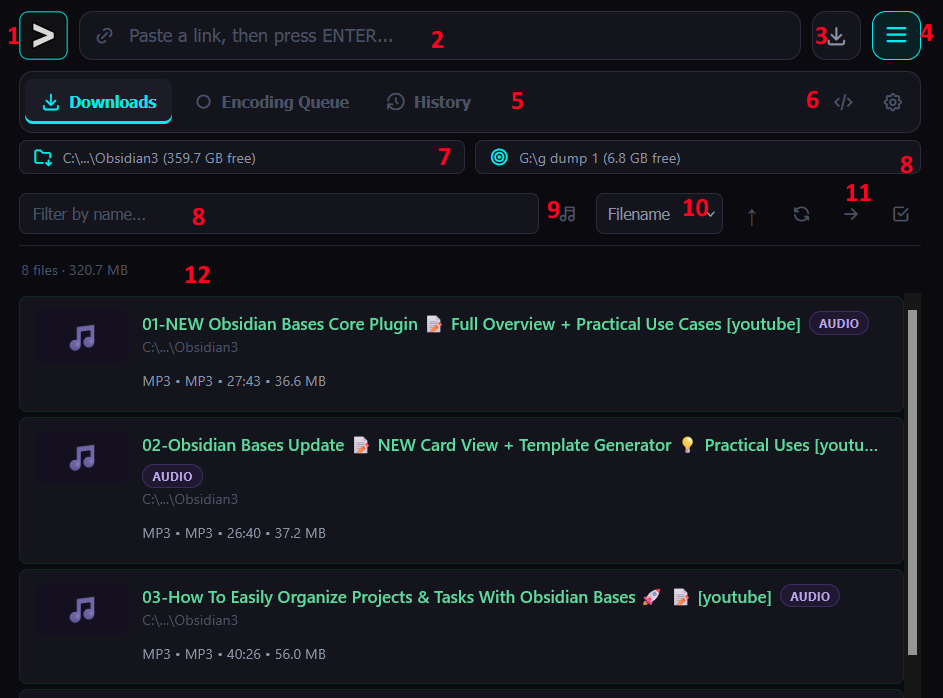

# StashDLP

A self-hosted, browser-based front end for [yt-dlp](https://github.com/yt-dlp/yt-dlp) — paste a link, watch it download, manage the results, all from a single page in your browser. Built with a Python/FastAPI backend and a vanilla JS frontend, with no database and no build step.

* [DESCRIPTION](#description)
* [FEATURES](#features)
* [INSTALLATION](#installation)
* [SCREENSHOTS](#screenshots)
* [USAGE](#usage)
  * [Downloading](#downloading)
  * [Playlists](#playlists)
  * [The ledger](#the-ledger)
  * [Playback](#playback)
  * [Re-encoding](#re-encoding)
  * [Synchronize audio](#synchronize-audio)
  * [Clipboard monitoring](#clipboard-monitoring)
  * [Custom yt-dlp arguments](#custom-yt-dlp-arguments)
  * [External programs](#external-programs)
* [CONFIGURATION](#configuration)
* [CHANGELOG](#changelog)

# DESCRIPTION

StashDLP wraps yt-dlp in a lightweight web UI so you can queue downloads, track their progress, and manage the resulting files without touching a terminal. It runs as a small FastAPI server (`backend/main.py`) that serves a static frontend and talks to yt-dlp/ffmpeg on your behalf, pushing live status over a websocket so the page updates itself as jobs progress.

It is designed to run locally or on a LAN box you leave on — point it at a download folder, paste links into it from any device on the network, and let it work through the queue.
# FEATURES

* **Paste-to-download** — drop a URL into the input field; the title is fetched automatically for review before the download starts (or immediately, if Auto-Confirm Titles is enabled).
* **Playlist detection** — a pasted playlist/channel URL is detected automatically (via `yt-dlp --flat-playlist`) and queued as a batch after a confirmation prompt, downloading several items in parallel up to a configurable concurrency cap.
* **Live download ledger** — every job (queued, downloading, done, errored) shows up as a card with progress, speed, and ETA, updated in real time over a websocket.
* **In-browser playback** — completed downloads play directly from the ledger, with resume support: a progress bar on each card shows how far you got, and a ✓ WATCHED / ✓ LISTENED badge marks anything played to the end.
* **Re-encoding queue** — send any completed file to a separate encode queue (resolution/quality/container controls, size estimate before you commit) without blocking new downloads.
* **Audio sync tool** — a clip-based workflow for correcting out-of-sync audio: preview a short clip at a chosen delay, iterate, then render the full file once you're happy with it.
* **Clipboard monitoring** (Windows) — optionally watch the clipboard for HTTP(S) URLs and kick off a download automatically the moment one is copied, regardless of which window is focused.
* **M3U8 stream detection** — Sites that are not supported by yt-dlp can sometimes be processes to download videos by sniffed for an underlying `.m3u8` playlist.  Toggle for auto fallback on fail in settings.
* **Per-domain yt-dlp arguments** — set default yt-dlp arguments globally or override them per domain (useful for things like `--impersonate chrome` on sites that block the default client).
* **External "open with" programs** — register your own editors/players and send a downloaded file to them straight from its card.
* **History log & search** — every completed/renamed download is logged, searchable later to recover the original URL for a file you already have.
* **Compact, resizable UI** — a narrow, dark desktop-style layout that scales down to a quarter-mobile-screen "ultra-narrow" mode showing just the essentials (URL box, transfer arrow, thumbnails, progress).

# INSTALLATION

StashDLP requires:

* **Python 3.9+**
* **[yt-dlp](https://github.com/yt-dlp/yt-dlp)** on your `PATH` (or installed into the same Python environment)
* **[ffmpeg](https://ffmpeg.org/)** on your `PATH`, for re-encoding and audio sync features
* **FastAPI**, **uvicorn**, and **pydantic** (`pip install fastapi uvicorn pydantic`)

Clone the repository, install the Python dependencies, and run the backend:

```bash
git clone https://github.com/<you>/stash_dlp.git
cd stash_dlp
pip install fastapi uvicorn pydantic
python backend/main.py
```

By default the server binds to `127.0.0.1:8722` (loopback only). Open `http://127.0.0.1:8722` in a browser to use it.

To make it reachable from other devices on your network, set:

```bash
STASH_DLP_HOST=0.0.0.0 python backend/main.py
```

`STASH_DLP_PORT` can be set the same way to change the port.

> **Note:** if you have more than one yt-dlp install on your system (e.g. a standalone binary alongside a pip-installed copy), invoking it as `python -m yt_dlp` is more reliable than a bare `yt-dlp` on your `PATH`, since it guarantees you're calling the same interpreter's copy the rest of the app is using.

# SCREENSHOTS

## Main UI

1. Logo.  Click to display current version.
2. Input box for download URLs
3. Button to start download (keybind: Enter)
4. Hamburger to show/hide settings
5. UI Tabs
6. yt-DLP arguments options and Settings
7. Download folder picker/selector
8. Target folder picker/selector
9. Audio files filter
10. Sorting categories
11. Sorting direction, refresh queue, move all downloads to target folder, multi-select options
12. Ledger statistics.


# USAGE

## Downloading

Paste a URL into the input field. StashDLP fetches the page title and stages the download for your review — edit the title if you like, then confirm to start it. Enable **Auto-Confirm Titles** in Settings to skip the review step and start immediately.

## Playlists

Pasting a playlist or channel URL is detected automatically and prompts for confirmation, showing the entry count before anything is queued. Confirmed playlists queue every entry at once (status `QUEUED`) and download a limited number concurrently, so a large playlist doesn't try to saturate your connection or the source site all at once.

## The ledger

The main view is a card-based ledger of every job: queued, downloading (with live progress/speed/ETA), and completed. Cards support drag-and-drop to external programs, right-click actions (rename, move, delete, open with...), multi-select for batch operations, and filtering/sorting by status, type, or name.

## Playback

Click a completed card to play it in-browser. Playback position is saved automatically, shown as a thin progress bar on the card so you can see at a glance what you've started, and a file is marked ✓ WATCHED / ✓ LISTENED once you reach the end — that flag sticks even if you rewatch it later.

## Re-encoding

Send a completed file to the encode queue to shrink it or change its container/resolution. The New Encode Job dialog shows original size, estimated output size, and percentage saved before you commit, plus advanced controls for audio, container, subtitles, and denoising.

## Synchronize audio

For files with drifted audio, the Synchronize Audio tool lets you dial in a delay against a short preview clip (rendered fast, not the whole file), iterate until it looks right, then render the full video only once you confirm it.

## Clipboard monitoring

On Windows, enable **Clipboard Monitoring** in Settings to have StashDLP watch for newly copied HTTP(S) URLs and start a download automatically, without needing the app window focused. StashDLP excludes its own copied links from triggering re-downloads.

## Custom yt-dlp arguments

Set default yt-dlp arguments applied to every download, plus per-domain overrides for sites that need special handling (for example, adding `--impersonate chrome` for a site returning Cloudflare 403 errors).

## External programs

Register external editors, players, or other tools in Settings, then send a completed file to any of them directly from its card's context menu.

# CONFIGURATION

Settings are stored in `_app_settings.json` next to the application. Per-download-folder data (the job queue, encode queue, history log, and thumbnail cache) is stored centrally under `library_data/`, keyed by the download folder in use, so switching between multiple download folders doesn't mix their histories together.

Environment variables:

| Variable         | Default     | Description                                                            |     |
| ---------------- | ----------- | ---------------------------------------------------------------------- | --- |
| `STASH_DLP_HOST` | `127.0.0.1` | Interface to bind the server to. Set to `0.0.0.0` to allow LAN access. |     |
| `STASH_DLP_PORT` | `8722`      | Port to listen on.                                                     |     |

# CHANGELOG

See [`CHANGELOG.md`](CHANGELOG.md) for the full version history.
